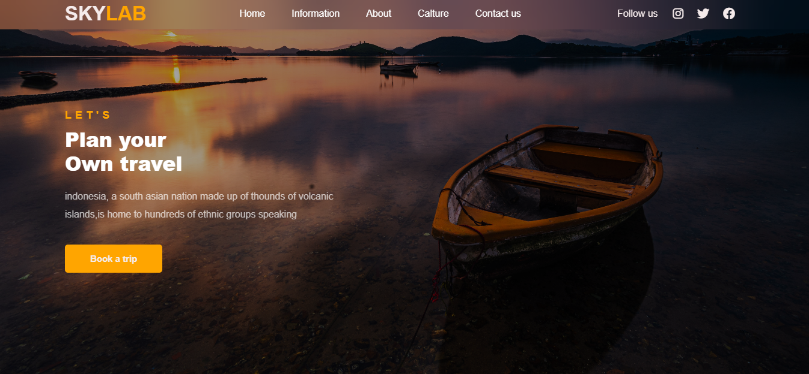
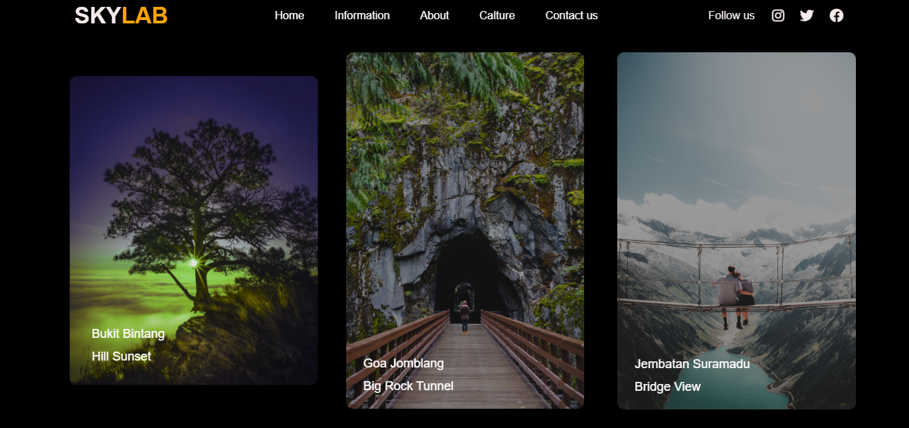

# 🏞️ SkyLab - Travel Tour Project

SkyLab is a travel tour website showcasing various destinations with detailed tours and beautiful imagery. Built with HTML, CSS, and Bootstrap, it provides a clean, intuitive, and user-friendly experience.

---

## 🌐 **Live Demo**

[SkyLab - Travel Tour Project](https://adarsh8086.github.io/SkyLab/)

---

## 🛠️ **Technologies Used**

- **HTML**: Structure of the website.
- **CSS**: Styling and layout.
- **Bootstrap**: For responsive design and pre-built components.

---

## 📦 **Features**

- 🧭 **Sticky Header**: The header stays fixed while scrolling for easy navigation.
- 📜 **Navigation Menu**: A clear and intuitive navigation bar to explore different sections.
- 🖼️ **Beautiful Imagery**: High-quality images to showcase destinations.
- 🏛️ **Cultural Insights**: Sections highlighting cultural and historical insights.
- 📩 **Newsletter Signup**: Stay updated with the latest travel tours.
- 📱 **Responsive Design**: Fully optimized for mobile, tablet, and desktop viewing.

---

## 🖼️ **Screenshots**

### 🏠 **Homepage**

### 🌍 **Destination Guide**

